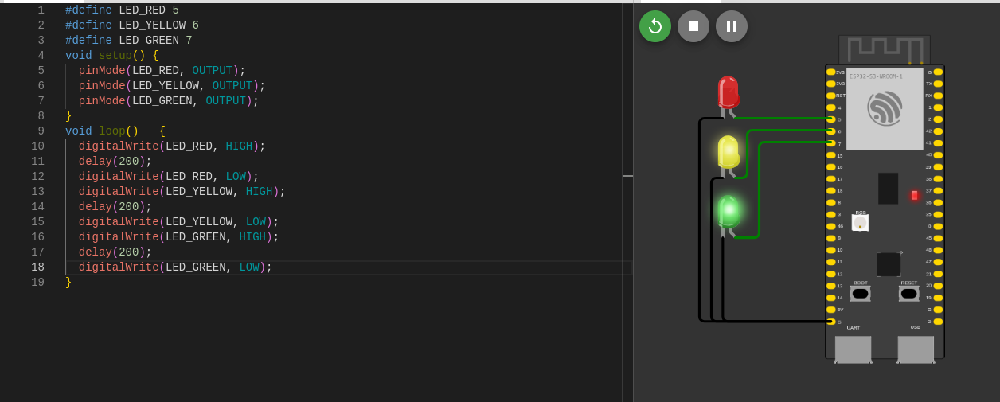

# LED Traffic Light di Wokwi

## Setup Proyek di Wokwi

### Requirements

- Akun Wokwi (https://wokwi.com)
- Browser modern
- File proyek lokal sudah lengkap (source RTOS, konfigurasi, dll)

### Membuat Proyek di Wokwi

1. Masuk ke https://wokwi.com.
2. Klik New Project dan pilih board yang sesuai (misal: Arduino UNO, ESP32, dsb).
3. Hapus kode default, unggah atau paste isi `sketch.ino`.
4. Tambahkan file konfigurasi RTOS jika diperlukan.
5. Buat atau unggah `diagram.json` untuk koneksi LED (contoh pin: LED_BUILTIN atau GPIO spesifik).
6. Simpan proyek (Save).

### Gambar Rangkaian

### Video

[LED Traffic Light](docs/LED.webm)
